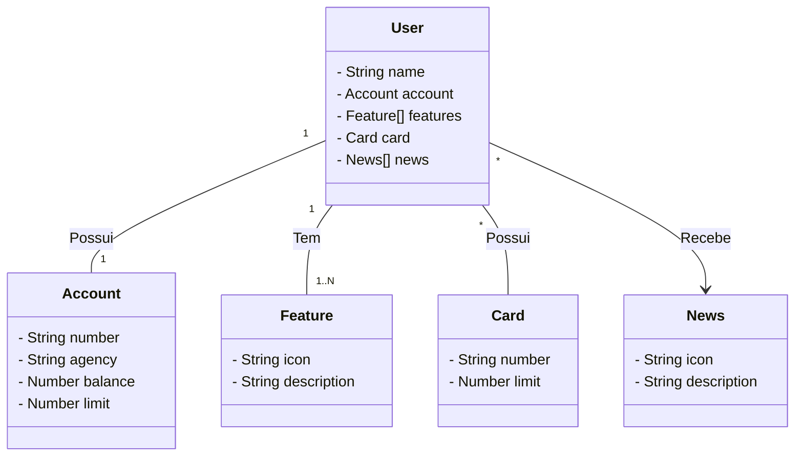

# Spring-boot-rest-api

# Projeto de API RESTful Spring Boot

Este é um projeto de exemplo de API RESTful desenvolvido em Spring Boot. A API realiza as seguintes operações:

1. Inserir usuário.
2. Atualizar usuário.
3. Mostrar usuários
4. Remover usuário.

## EndPoints


## Acessando a API

Você pode acessar a API implantada através do seguinte link:

[API Spring Boot no Render](https://spring-boot-rest-api-7el0.onrender.com/swagger-ui/index.htm)

A interface do Swagger está disponível para ajudar na exploração das funcionalidades da API.

## Pré-requisitos

Antes de começar, certifique-se de ter as seguintes ferramentas instaladas:

# Requisitos do Projeto

Aqui estão os requisitos necessários para configurar e executar este projeto em sua máquina local:

## Pré-requisitos

Antes de começar, certifique-se de ter as seguintes ferramentas e tecnologias instaladas em seu sistema:

- [JDK]([https://www.oracle.com/java/technologies/javase-downloads.html](https://www.oracle.com/java/technologies/javase/jdk17-archive-downloads.html)) (versão 17): A linguagem de programação principal usada neste projeto.
- [Maven](https://maven.apache.org/download.cgi): Uma ferramenta de gerenciamento de dependências usada para compilar e construir o projeto.
- [Docker](https://docs.docker.com/get-docker/) (opcional): Usado para implantar a aplicação em um contêiner.
- [PostgreSQL](https://www.postgresql.org/download/) (opcional): Banco de dados usado pelo projeto. Certifique-se de que o PostgreSQL esteja em execução e as credenciais de banco de dados corretas sejam configuradas (veja abaixo).

## Configuração do Banco de Dados

Este projeto requer um banco de dados PostgreSQL para armazenar dados. Siga as instruções abaixo para configurar o banco de dados e o arquivo `application.properties`:

### 1. Crie o Banco de Dados

Antes de configurar o aplicativo, é necessário criar um banco de dados PostgreSQL. Você pode fazer isso manualmente ou usando uma ferramenta de gerenciamento de banco de dados como o pgAdmin. Certifique-se de lembrar as seguintes informações:

- **Nome do Banco de Dados**: `seu-banco-de-dados`
- **Nome de Usuário do Banco de Dados**: `seu-usuario`
- **Senha do Banco de Dados**: `sua-senha`

Substitua `seu-banco-de-dados`, `seu-usuario` e `sua-senha` pelas informações que você deseja usar.

### 2. Configure o `application.properties`

No diretório do projeto, você encontrará um arquivo chamado `src/main/resources/application.properties`. Abra este arquivo em um editor de texto e configure as seguintes propriedades do banco de dados:

```properties
spring.datasource.url=jdbc:postgresql://localhost:5432/seu-banco-de-dados
spring.datasource.username=seu-usuario
spring.datasource.password=sua-senha


spring.jpa.properties.hibernate.dialect=org.hibernate.dialect.PostgreSQLDialect
spring.jpa.hibernate.ddl-auto=update
spring.jpa.show-sql=true
spring.jpa.properties.hibernate.format_sql=true
server.tomcat.acceslog.enabled=true


  ```
### Como Executar

Siga as seguintes etapas para configurar e executar o projeto em sua máquina:

1. Clone o repositório para sua máquina local:
 git clone https://github.com/LucasJnoub/spring-boot-rest-api.git
2. Entre no diretório de projeto:
 cd .\spring-boot-rest-api\
3. Compile o código:
mvn clean package -DskipTests
5. Execute o seguinte comando:
java -jar target/J-api.jar
6. Por fim entre nesse link:
http://localhost:8080/swagger-ui.html


